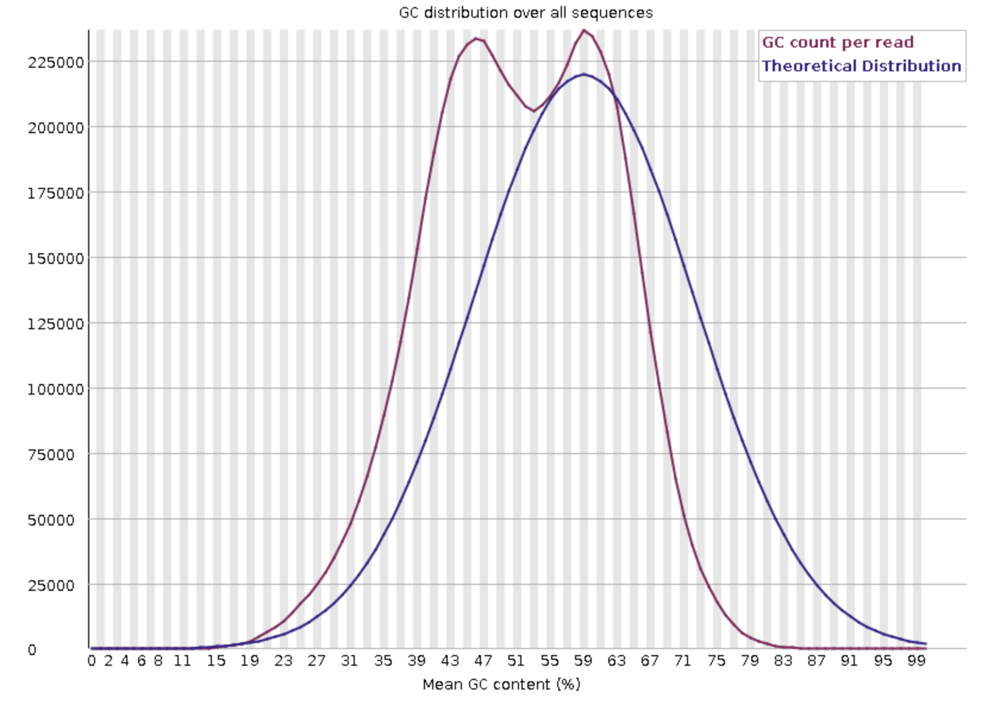
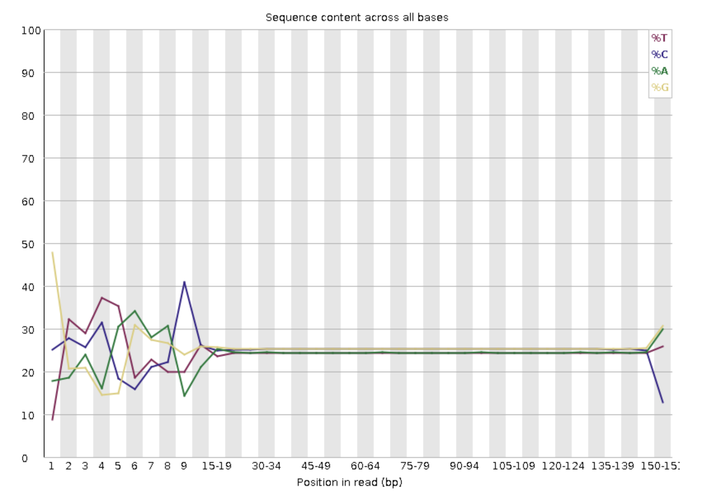
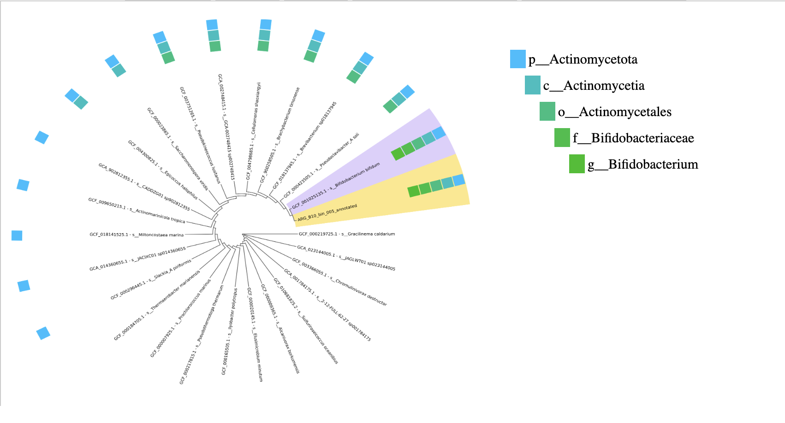
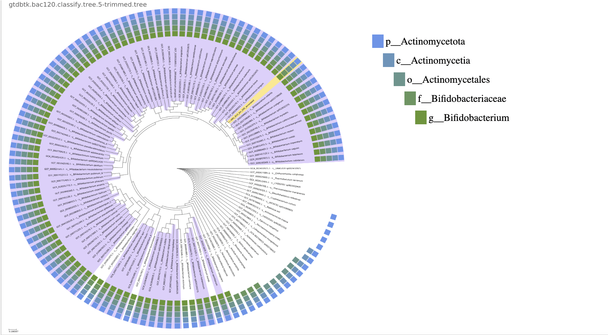
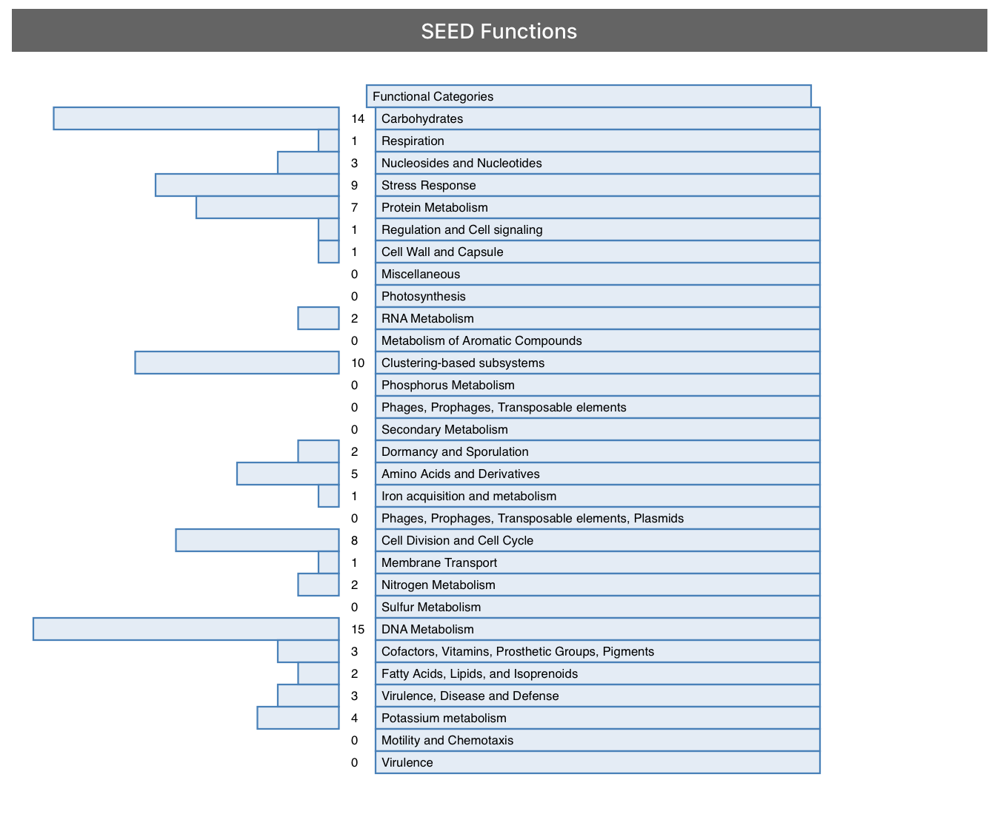
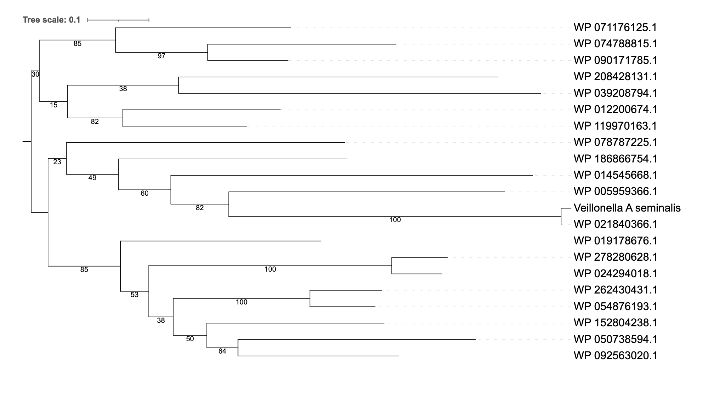
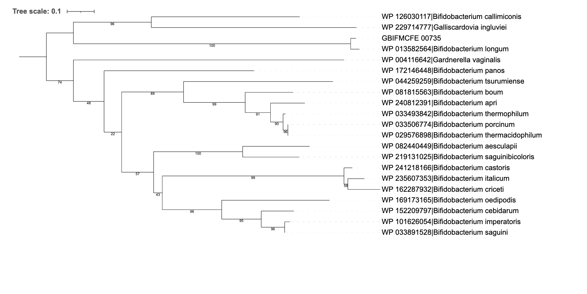

# Introduction

The human microbiota is composed mainly of bacteria but also includes viruses, archaea, molds, yeasts and protozoa. The microorganisms that colonise the human body are located on the skin, in the respiratory, digestive and genitourinary systems, as well as in the secretory glands, such as the mammary, biliary, and sebaceous glands. The gut microbiome is complex and dynamic, with implications for both health and disease. During infancy and due to different factors, such as diet or other external factors, the microbial population develops. Moreover, it is at this stage that a direct relationship has been observed between the acquisition of a varied and stable microbiome and the development of an optimal immune system and resistance to pathogenic infections. Nevertheless, the understanding of the specific bacterial species and their contributions remains incomplete.

In this study, it is performed a reconstruction and a characterisation of metagenome-assembled genomes (MAGs) from a stool sample (**ARG_B10**) to analyse the gut microbiome of a healthy 1-year-old male, born vaginally in Argentina. In order to identify microbial species and their physiological functions, shotgun metagenomics and bioinformatic tools are used for genome assembly and identification. Nine high-quality MAGs have been identified; however, following strict criteria such as genome completeness (>90%) and contamination (<5%), only ***Veillonella atypica seminalis***, named as **bin.002**, and ***Bifidobacterium longum***, named as **bin.005**, were chosen.

On the one hand, ***Veillonella atypica seminalis*** is a Gram-negative anaerobe bacteria which is part of the oral, gastrointestinal and vaginal microbiota. It transforms lactic acid into short-chain fatty acids, which play an important role in intestinal health. On the other hand, ***Bifidobacterium longum*** is a Gram-positive anaerobe bacteria that is also found in the intestinal tract, and, as it is involved in the metabolism of complex carbohydrates such as human milk oligosaccharides, it is among the earliest microbes to colonise the gut and it is the most prevalent in both adult and newborn intestines. In addition, B. longum is recognised for providing probiotic benefits, including enhancing immune response and protection against pathogens.

As a result of the presence of these two species in the fecal sample, this study aims to identify the functional roles and contributions to health by characterising them. Additionally, comparative analyses of the genomes obtained with the genomes of reference of each species have been carried out to explore evolutionary changes and differences in functional potential.

## Objetivos

Este es un subtítulo que aparecerá **anidado** debajo de la sección "Introducción" en la barra lateral.

# Methods

## Descripción de Datos

Este subtítulo aparecerá bajo "Métodos".

## Análisis Estadístico

Otro subtítulo anidado bajo "Métodos".

# Results

This project was conducted using the **ARG_B10** sample, which is a data set result of sequencing a sample of the subject using the Illumina NovaSeq platform. The results aimed to analyse the gut microbiome profile to understand the microbial compositions of the patient, and the relation with health outcomes in early childhood.

### PRACTICAL 5

The protocol started with an unprocessed patient sample. Thus, as explained in the methodology section, we used different K-base tools to obtain two high-quality metagenome-assembled genomes (MAGs). 

Firstly, a Fast-QC was executed for raw read quality control and analysis. So, in this preliminary stage of the protocol, it was found that the first 15 nucleotides had a pattern of fluctuations indicating that the quality of the sequence was not optimal in this reading. Nonetheless, from this point onward the distribution of the different nucleotides was balanced, which suggested a good signal of quality of the DNA sequence, indicating absence of artefacts or significant deviations. In this Fast-QC, it could also be noted that although there are minor variations that suggest potential biases or sequencing features, the sequencing reads' GC distribution generally matches with the theoretical expectations (normal Distribution of GC content). 

  
 Figure 1. GC content.

  

The protocol continued with trimmomatic, in which the first 15 nucleotides were cut to improve the quality of the reading. After the execution of this protocol step, another FastQC was fulfilled, and the results observed were that the nucleotide distribution was improved, and even though the GC content was already at an optimal level, we did not succeed in enhancing it further.    

  
 Figure 2. Sequence conent across the bases.

  

The succeeding step in the protocol was MEGAHIT, resulting in an assembly containing a total of 1922 contigs, with 436 contigs being at least 10,000 bp long. The N50 value was 28.019 suggesting that the assembly is moderately contiguous, with many contigs of smaller size, and, as was previously observed the GC content is relatively high at 54.05%, indicating a good quality. 

Finally, MaxBin was carried out with a 96.1% successfulness in binning of the input contigs, which represents 98.6% of the total sequence length. Therefore, only a 3.9% fraction of the contigs were unbinned, indicating that most of the data was grouped into distinct metagenomic bins. Thus, 9 bins were created. The CheckM tool was used to determine which will be the bins (MAGs) that are going to be used for developing the project. Moreover, the criteria for inclusion in the project was a high-quality of the MAG having a >90% completeness and <5% contamination. Hence, the MAGs chosen for the project were bin.002 (**o_Selenomonadales**), with a 99.4% of completeness and 0% of contamination; and bin.005 (**f_Bifidobacteriaceae**) with 100% completeness and 2.42% contamination. 

  
 Figure 3. 

  

  
 Figure 4.

  

### PRACTICAL 6

Once the MAGs were selected, the project proceeds with the identification of the species to which the MAGs correspond, using the Prokka K-base tool. Basically, the genome for the bin.002 contains 2033 predicted genes, with 1984 being protein-coding (1299 have known functions, and specifically 603 of these genes are linked to enzymatic activities), whereas the bin.005 contains 1997 predicted genes, with 1940 being protein-coding (1125 have known functions, and specifically 520 of these genes are linked to enzymatic activities). Hence, as soon as the genome assemblies were annotated, a Batch was executed to create a GenomeSet of the species without specifying the names. 

  
 Figure 5. 

  

  
 Figure 5. 

  

  
 Figure 6. 

  

  
 Figure 7. 

  

The GTDB classifier was then used to taxonomically classify the MAGs and obtain the genome information. The data used for the taxonomic classification was the **ARG_B10_bin002_annotated** and **ARG_B10_bin005_annotated**, which were obtained using the Prokka. So, basically the outcome was the objective taxonomic assignments for the bacterias based on the GTDB. Furthermore, the classification obtained is observed in Table X.

After obtaining this information, the genomes of reference were searched in GTDB. Then, annotations obtained by Prokka were **GCA_reference_typestrain.002** and **GCA_reference_typestrain.005**. On the one hand, the first one contains 2129 predicted genes, with 2078 being protein-coding (1315 have known functions, and specifically 600 of these genes are linked to enzymatic activities). On the other hand, the second one contains 2032 predicted genes, with 1946 being protein-coding (1134 have known functions, and specifically 495 of these genes are linked to enzymatic activities). 

Finally, a FastANI was computed to assess the nucleotide identity between the target strains and the reference ones. For the ***Veillonella atypica seminalis***, the ANI Estimated was 99.1958%, precisely 650 matches were found in a total of 710. Regarding ***Bifidobacterium longum***, the ANI Estimated was 98.8581%, precisely 658 matches were found in a total of 796. 

### PRACTICAL 7

Following the completion of the last practical and using the annotations obtained using Prokka, this practical aimed to determine the functional categories encoded in the genome of ***Veillonella atypica seminalis*** and ***Bifidobacterium longum*** as well as the difference compared to the reference genomes of each bacterium.

As for ***Veillonella atypica seminalis***, it can be observed that for most of the functional categories, the number of genes is the same. However, there are some categories where the number of genes differs between the target bacterium and the reference genome. The results obtained can be observed in Figure X. 

Regarding ***Bifidobacterium longum***, also the number of genes between the two strains are the same in most of the functional categories. Nonetheless, there are some categories where the number of genes differs between the target bacterium and the reference genome. The results obtained are shown in Figure Y. 

Finally, for each MAG and reference genome, one gene present functional category was selected in order to obtain the nucleotide and amino acid sequence and perform a Pairwise Sequence Alignment. For ***Veillonella atypica seminalis***,  the selected one was from the Stress Response functional category, concretely encoding an organic hydroperoxide resistance transcriptional regulator protein involved in oxidative stress. After performing the alignment, it can be observed that there are some nucleotide changes between the reference and the MAG genome, as well as in amino acid residues between the sequences. Thus, the results probably indicate that natural selection has occurred adapting the MAG strain to stress conditions, and therefore, favoring its growth. 
 
With respect to ***Bifidobacterium longum*** the gene selected was from Virulence, Disease and Defense functional category, concretely encoding a signal peptidase I which is involved in proper protein maturation and localization. After performing the alignment between both strains it can be observed that there are some nucleotide changes between the reference and the MAG genome, likewise amino acids changes between the sequences. Thus, the result probably indicates that natural selection has occurred adapting the MAG to adverse conditions in order to be more efficient in producing defense proteins, and therefore, favoring its adaptability and survival. 

  
 Figure 8. 

  

### PRACTICAL 8

In this practical, in order to make a further study of the organisms of the sample, a phylogenetic analysis of protein sequences selected was performed. 

In the case of ***Veillonella atypica seminalis***, it can be observed how the transcriptional regulator protein of resistance to organic hyperoxides is comprehended in a group that includes other proteins of the same family, predominant in organisms of the Veillonellacaea family. In addition, it can be seen that the Bootstrap of the branches are high, indicating that most of them have a high clustering confidence. Thus, this allows us to affirm that this protein studied has been conserved between species, as it plays a crucial role in the resistance to oxidative stress. 

In the case of ***Bifidobacterium longum***, the analysed gene is more closely related to genes that are adapted to similar gut environments in other species of the Bifidobacteriaceae family. Within this family, the ***Bifidobacterium callimiconis*** and ***Galliscardovia ingluviei*** are the ones most evolutively related to the analysed species.

  
 Figure 9. 

  

  
 Figure 9. 

  

## Discussion

The gut microbiota has been recently considered to be an environmental factor that could contribute to disease development. Therefore, this study provides a comprehensive characterization and analysis of bacterial strains, offering a holistic approach to help determine the genetic composition, functional potential and evolutionary relationships of the bacteria in the sample.
 
Firstly, the quality control performed revealed that the first 15 nucleotides of the raw reads exhibited fluctuations, which was indicative of suboptimal sequencing quality in that region. Therefore, by trimming the first 15 nucleotides, the nucleotide distribution was improved, obtaining just the higher-quality reads. Regarding the GC content, although initially it was high, after trimming it persisted optimal, reinforcing the reliability of the data. Furthermore, the sequence quality modifications were necessary to achieve high-quality assemblies with MEGAHIT, resulting in 1922 contigs. Nonetheless, the 28,019 N50 value supplied further support to the quality of the assembly, suggesting that the genome data was sufficiently continuous for downstream analysis.
 
MaxBin and CheckM tools were then used for binning and assessing the completeness and contamination of the assembled genomes. As for the binning process, it was achieved with an outstanding accomplishment rate of 96.1%, indicating that most of the sequences were grouped into the nine different metagenomic bins. Moreover, two of these nine metagenomics reads were selected for the study, concretely bin.002 from the Selenomonadales order and bin.005 corresponding to Bifidobacteriaceae family. The selection of the bins was made according to high completeness and low contamination 99,4% and 0% for the first bin and 100% and 2.42% for the other one. 
 
Regarding the taxonomic classification, using the GTDB it was confirmed that bin.002 corresponds to ***Veillonella atypica seminalis*** and bin.005 to ***Bifidobacterium longum***, which corresponds with previously reported results. Afterall, the taxonomic results obtained with the FastANI revealed a close genetic relationship between the MAGs and their reference genomes, specifically 99.2% for ***Veillonella atypica seminalis*** and 98.9% for ***Bifidobacterium longum***. 
 
The functional analysis displayed interesting insights into the metabolic pathways and genetic composition of both bacterial strains. For ***Veillonella atypica seminalis*** most of the functional categories aligned with the reference genome, although some differences were observed in some of the categories. Notably, the number of genes encoded in the carbohydrates functional category was superior in the target strain compared to the reference. This result could indicate that the presence of adaptations in our strain were caused by microbiome or host interactions. Similarly, ***Bifidobacterium longum*** showed in the majority of functional categories the same number of genes as the reference organism, nonetheless in certain categories some different number coding genes were found. In the end, these results emphasise the genomic variation within the species and may also indicate strain-specific adaptations.  

Going further with the analysis, the genetic variability was explored by performing a pairwise sequence alignments of selected genes. Specifically, for the ***Veillonella atypica seminalis*** the encoding gene selected was an organic hydroperoxide resistance transcriptional regulator, which revealed nucleotide and amino acid changes between the MAG and reference genome. So again, it is reflected that a natural selection process may have occurred to the target strain, enabling the strain to adapt to oxidative stress conditions. Likewise, the signal peptidase I protein of ***Bifidobacterium longum*** also displayed nucleotide and amino acid variations, indicating that the strain has undergone selection pressures that have allowed it to enhance its defense systems and adapt to harsh environments.
Finally, by carrying out a phylogenetic analysis, it has been possible to reaffirm the results obtained previously. Furthermore, this analysis has enables to obtain an additional context of the evolutionary history of the selected genes. In ***Veillonella atypica seminalis***, the protein studied has been grouped within a clade that contains other proteins from the same family of organisms belonging to the Veillonellaceae family. This allows us to corroborate that there is a high conservation, due to the crucial role of this protein in resistance to oxidative stress. Similarly, in ***Bifidobacterium longum*** it has been observed that the protein studied is related to homologous genes of species such as B. callimiconis and Galliscardovia ingluviei, highlighting the importance of evolutionary pressures on genomic adaptations.

(FALTA ÚLTIM PARÀGRAF)

# Conclusiones

Sección principal para el cierre.
